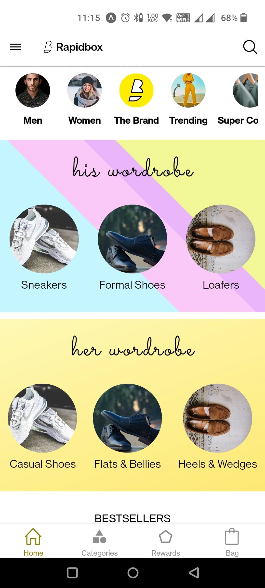

# Rapidbox App Clone (Shopping App)

## Table of contents

- [Overview](#overview)
- [Screenshot](#screenshots)
- [Download the app](#Download-the-app)
- [Built with](#Built-with)

## Overview

- Rapidbox is an online shopping app. I have build this project form it's design.
- You will see multiple products like sneakers, jackets, t-shirts and much more.
- To render everything beautifully, I designed a number of custom components.
- React Navigation library is used to add navigation system.
- I made an effort to mirror the design of the original app exactly.
- The app only has a frontend design at the moment, and dummy data is being pulled from a data file.

## Screenshots

## Download the app

-

## Built with

- React Native
- Expo
- Typescript
- React Navigation
- Styled Components
